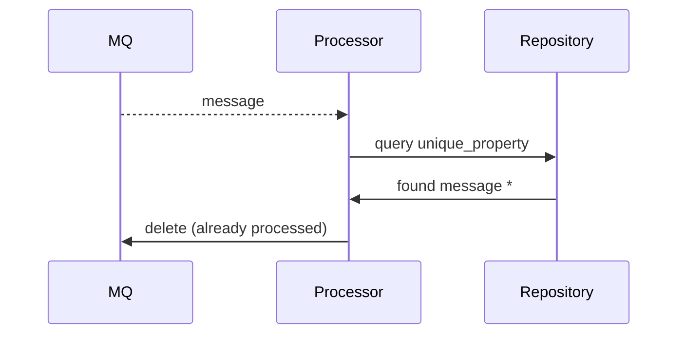
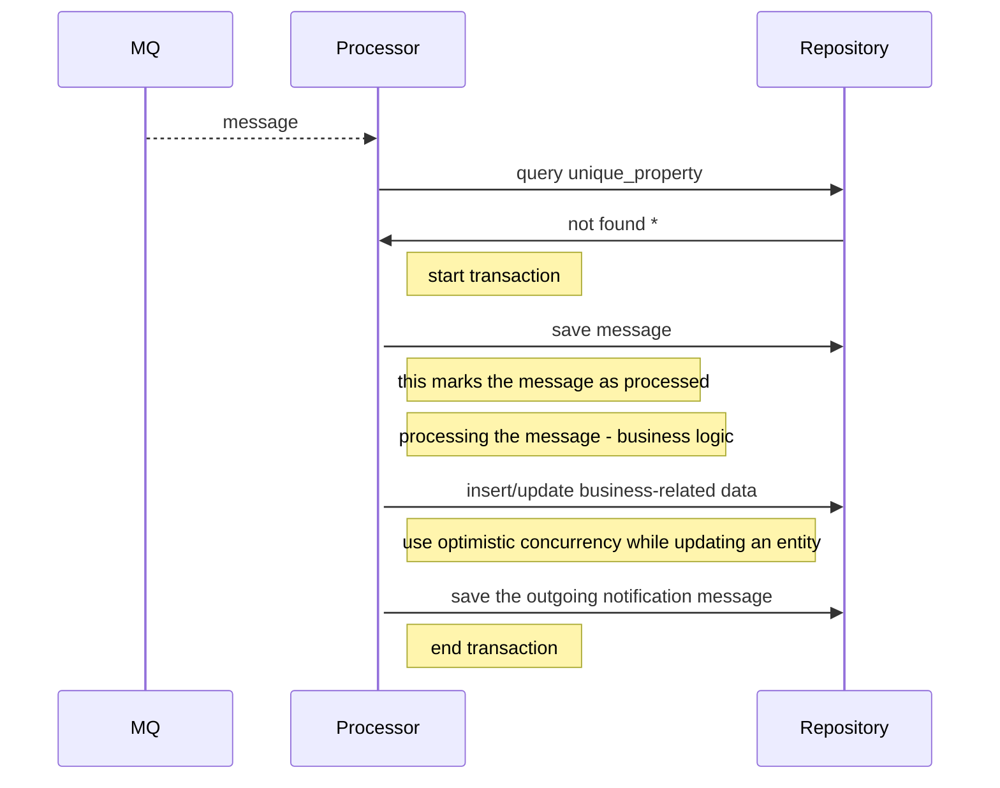
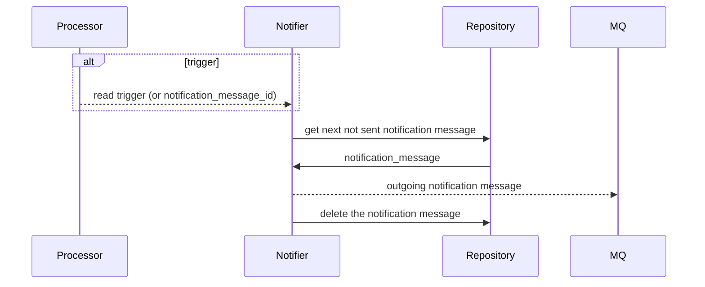

```mermaid
sequenceDiagram
    MQ-->>Processor: message
    Processor->>Repository: query unique_property
    Repository->>Processor: found message *
    Processor->>MQ: delete (already processed)
```

```mermaid
sequenceDiagram
    MQ-->>Processor: message
    Processor->>Repository: query unique_property
    Repository->>Processor: not found *
    activate Processor
    Note right of Processor: start transaction
    Processor->>Repository: save message
    Note right of Processor: this marks the message as processed
    Note right of Processor: processing the message - business logic
    Processor->>Repository: insert/update business-related data
    Note right of Processor: use optimistic concurrency while updating an entity
    Processor->>Repository: save the outgoing notification message
    Note right of Processor: end transaction
```

```mermaid
sequenceDiagram
    alt trigger
        Processor-->>Notifier: read trigger (or notification_message_id)
    end
    Notifier->>Repository: get next not sent notification message
    Repository->>Notifier: notification_message
    Notifier-->>MQ: outgoing notification message
    Notifier->>Repository: delete the notification message
```
